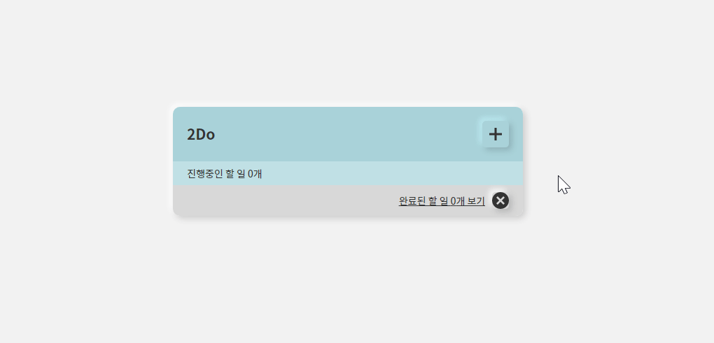
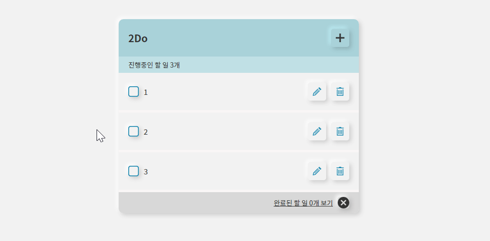
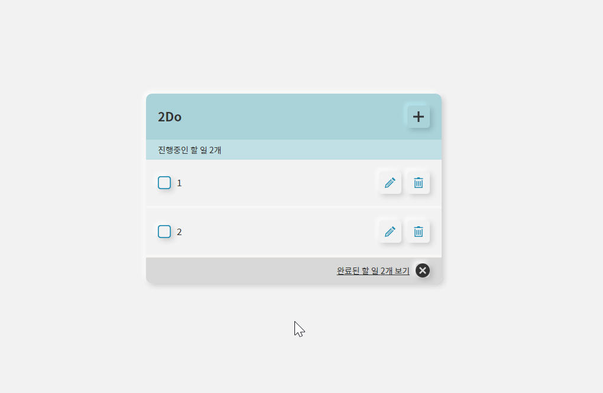
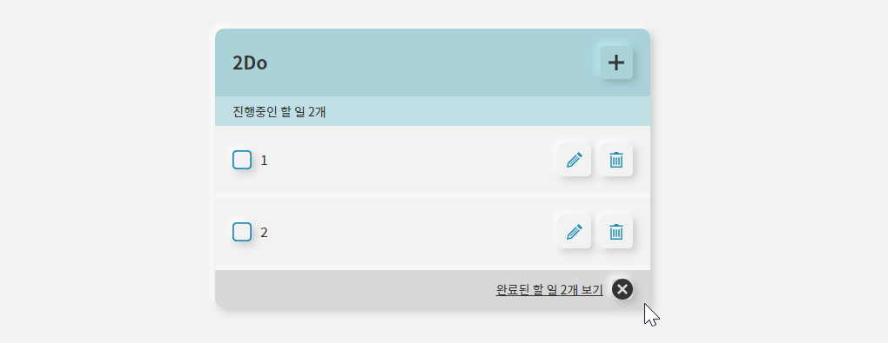
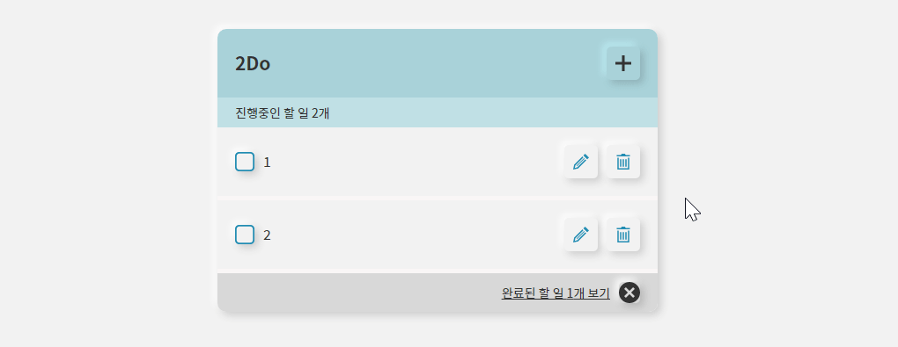
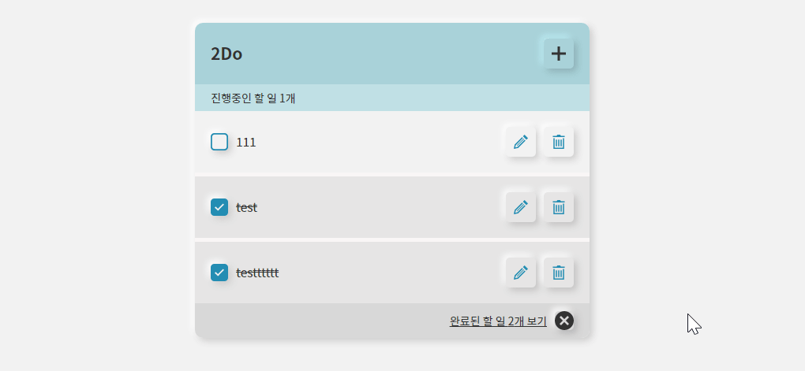

# Vanilla JavaScript로 만든 2DoApp

- [Vanilla JavaScript로 만든 2DoApp](#vanilla-javascript로-만든-2doapp)
  - [Technologies](#technologies)
  - [할 일 추가](#할-일-추가)
  - [할 일 완료 처리](#할-일-완료-처리)
  - [할 일 조회](#할-일-조회)
  - [할 일 수정](#할-일-수정)
  - [할 일 삭제](#할-일-삭제)

## Technologies

- neumorphism CSS
- Web Stroage(`localStorage`) + `Promise` + `async/ await`

## 할 일 추가

## 할 일 완료 처리

## 할 일 조회

**✅ 카테고리 별 조회**

- 진행중인 할 일과 완료된 할 일 구분

## 할 일 수정

**✅ 비교**

- 이전 값과 비교 후 다를 때만 수정 api 요청

## 할 일 삭제

- 할 일 삭제
  
- 완료된 할 일 전체 삭제
  
